University: [ITMO University](https://itmo.ru/ru/)  
Faculty: [FICT](https://fict.itmo.ru)  
Course: [IP-telephony](https://github.com/itmo-ict-faculty/ip-telephony)  
Year: 2024/2025  
Group: K34202  
Author: Demin Gleb Igorevich  
Lab: Lab1  
Date of create: 08.03.2025  
Date of finished: 11.03.2025

## Отчёт о Лабораторной работе №1   "Базовая настройка ip-телефонов в среде Сisco packet tracer"

### Описание работы

Для выполнения данной лабораторной работы собирается схема соединения. Необходимо проверить, правильно ли подключены и настроены все узлы устройств.

### Цель работы

Изучить рабочую среду Cisco Packet Tracer, ознакомиться с интерфейсами основных устройств, типами кабелей, научиться собирать топологию. Изучить построение сети IP-телефонии с помощью маршрутизатора, коммутатора и IP телефонов Cisco 7960 в среде Packet tracer.

### Ход работы

#### Часть 1

На первом этапе работы требовалось смоделировать базовую сетевую топологию в среде Cisco Packet Tracer. Конфигурация включала 7 клиентских устройств (ПК) и 4 коммутатора уровня L2 (Switch-PT). При проектировании логической схемы:  

- Межкоммутаторные соединения реализованы через **кросс-овер кабели**.  
- Подключение ПК к коммутаторам выполнено **прямыми кабелями (straight-through)**.  

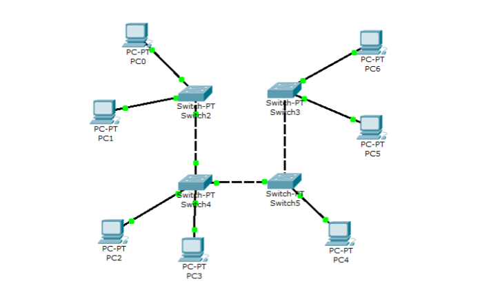

**Настройка VLAN и транковых портов:**  

- На всех коммутаторах интерфейсы, ведущие к ПК, были назначены на **VLAN 1** (данные).  
- Порты между коммутаторами переведены в **транковый режим (trunk)** с разрешением передачи трафика VLAN.  

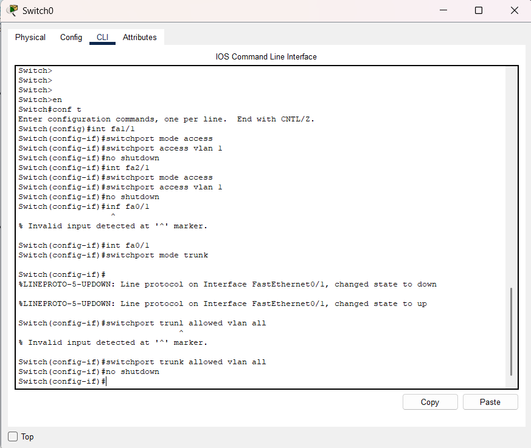  

**Распределение IP-адресов:**  
Клиентским устройствам вручную присвоены статические адреса из диапазона 192.168.0.10–192.168.0.16 с маской /24. Шлюз по умолчанию не требовался, так как все узлы находились в едином адресном пространстве.  

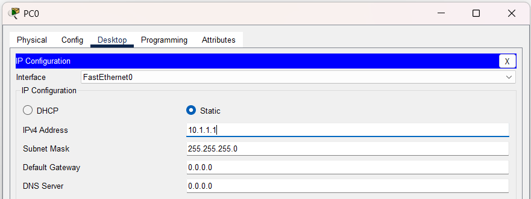  

**Верификация работоспособности:**    
После завершения конфигурации успешно проверена связность между узлами:  

- PC0 → PC6 
- PC2 → PC4 

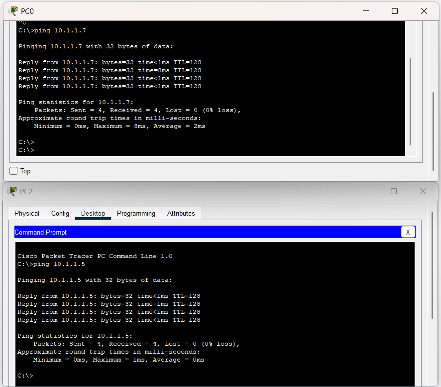  

#### Часть 2

**1. Сборка схемы**  
В новом проекте .pkt воссоздана топология с:  

- Маршрутизатором Cisco 2811 (переименован в **CMERouter**)
- Коммутатором L2
- Двойкой IP-телефонов Cisco

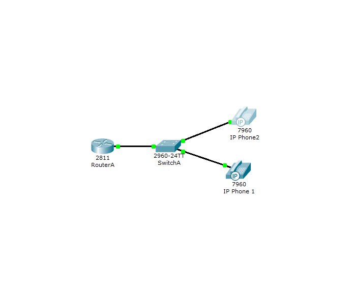  

Все соединения выполнены прямыми кабелями.  

**2. Базовая настройка маршрутизатора**  

Интерфейсу **FastEthernet 0/0** присвоен IP: **192.168.1.1/24**.

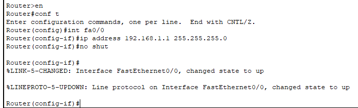  

**3. Реализация DHCP-сервисов**  
Создано два пула адресов:  
- **Данные**: 192.168.1.0/24 (для ПК)
- **Голосовая связь**: 192.168.2.0/24 (для телефонов). *Параметр option 150 указан для передачи IP TFTP-сервера (CMERouter).*

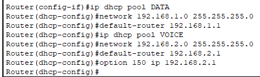  

**4. Развёртывание Cisco CME**  
В режиме глобальной конфигурации:  

- Лимит регистрации: **max-ephones 2, max-dn 2**
- Адрес SIP-трафика: **ip source-address 192.168.1.1**
- Автоназначение номеров: **auto assign**

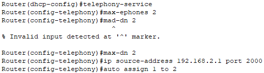  

**5. Сегментация сети через VLAN**  
На маршрутизаторе созданы подынтерфейсы:  

- **Fa0/0.1** (VLAN 1, native) — данные
- **Fa0/0.2** (VLAN 2, 802.1Q) — голос

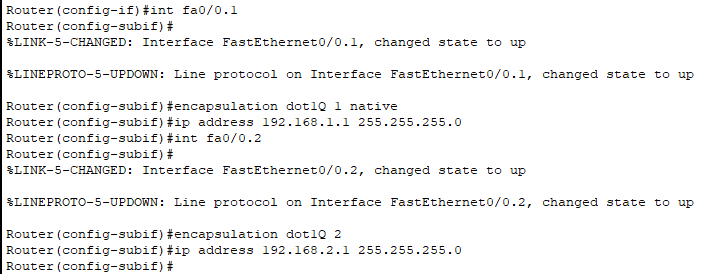  

**6. Конфигурация коммутатора**  
Порты для подключения телефонов настроены с:  

- access VLAN 1 (данные)
- voice VLAN 2 (приоритет трафика)

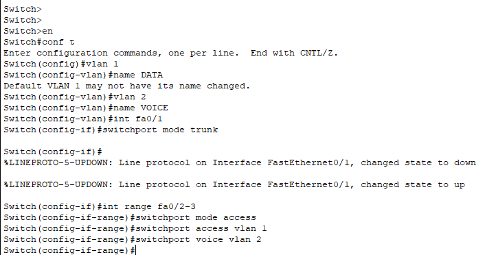  

**7. Регистрация устройств**  
Телефонам присвоены номера **1001** и **1002**. После получения IP через DHCP они успешно зарегистрировались в CME.  

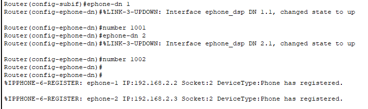  

**8. Тестирование функционала**  
Установлен тестовый звонок 1001 → 1002 (скриншот вызова).

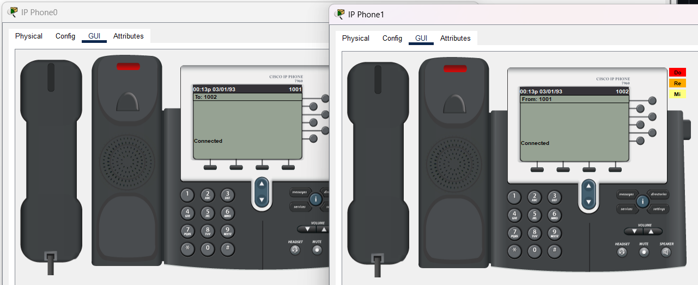  

### Вывод
В данной работе мы познакомились с базовой настройкой устройств в Cisco Packet Tracer и построили две схемы сетей, в которой настроили связанность ПК и IP-телефонов.
