University: [ITMO University](https://itmo.ru/ru/)  
Faculty: [FICT](https://fict.itmo.ru)  
Course: [IP-telephony](https://github.com/itmo-ict-faculty/ip-telephony)  
Year: 2024/2025  
Group: K34202  
Author: Demin Gleb Igorevich  
Lab: Lab2  
Date of create: 10.03.2025  
Date of finished: 10.03.2025  

# Отчёт о Лабораторной работе №2 <br/>"Конфигурация voip в среде Сisco packet tracer"

## Описание работы

Для выполнения данной лабораторной работы собирается схема соединения. Необходимо проверить, правильно ли подключены все узлы устройств. Предварительно удалить все преды- дущие конфигурационные файлы на маршрутизаторах Cisco 2811, на коммутаторе Cisco catalyst 3560.

## Цель работы

Изучить построение сети IP-телефонии с помощью маршрутизатора Cisco 2811, коммутатора Cisco catalyst 3560 и IP телефонов Cisco 7960.

## Ход работы
### Часть 1. Построение базовой инфраструктуры VoIP-сети
**Топология сети**
Конфигурация включала:
- Маршрутизатор Cisco 2811
- Коммутатор Cisco Catalyst 3560
- Два IP-телефона Cisco
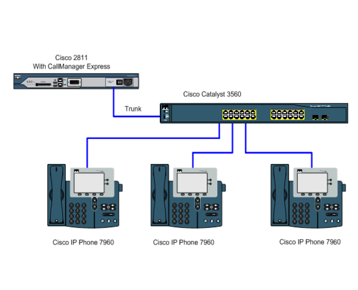  

**1. Переименование маршрутизатора**  
В глобальном режиме конфигурации выполнено:  
`hostname CMERouter`  

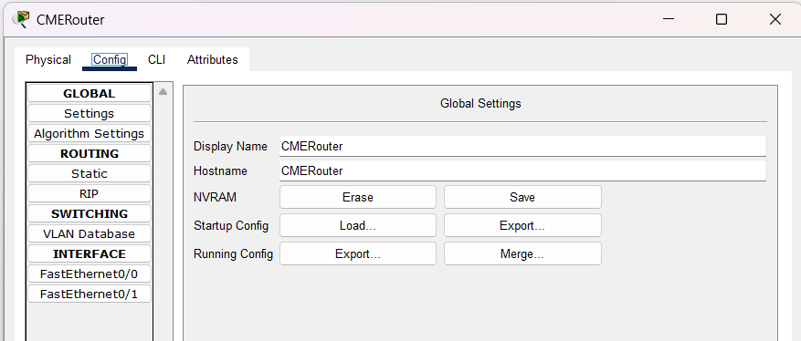  

**2. Отключение DNS-поиска**  
Для устранения задержек при ошибочном вводе команд деактивирован DNS-резолвинг:  
`no ip domain-lookup`  

**3. Настройка парольной защиты**  
Реализована многоуровневая аутентификация:  
- **Консольный доступ**: `password cisco` + `login`
- **Telnet**: `password cisco` + `login`
- **Привилегированный режим**: `enable secret cisco`  
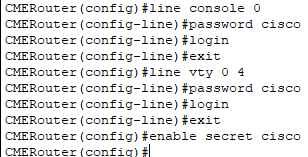

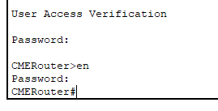  

**4. Конфигурация интерфейса FastEthernet 0/0**  
Созданы подынтерфейсы для сегментации трафика:  
- **Fa0/0.1**: Данные (VLAN 10, IP: 192.168.10.1/24)
- **Fa0/0.2**: Голос (VLAN 20, IP: 192.168.20.1/24)

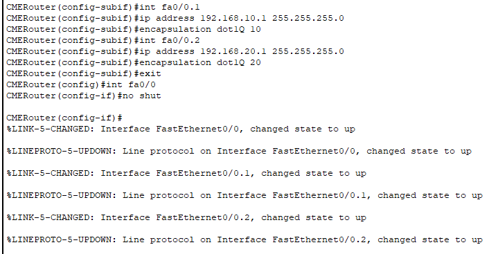  

**5. Развёртывание DHCP-серверов**
Созданы пулы адресов для разных типов трафика:  

- Данные:
```
network 192.168.10.0/24  
default-router 192.168.10.1
```
- Голос:
```
network 192.168.20.0/24  
option 150 ip 192.168.20.1
```
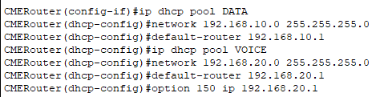  

**6. Интеграция Cisco CME**  
Настроены параметры телефонии:
```
telephony-service  
 max-ephones 3  
 max-dn 3  
 ip source-address 192.168.10.1  
 auto assign 1 to 3
```
Зарегистрированы номера: **1001, 1002, 1003**.  

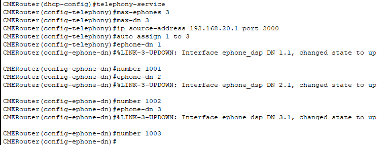  

**7. Настройка VLAN на коммутаторе**  
Выполнено:  

1. Создание VLAN 10 (данные) и VLAN 20 (голос).
2. Назначение портов:
- Access: VLAN 10 для ПК
- Voice: VLAN 20 для телефонов
3. Настройка транкового порта к маршрутизатору.

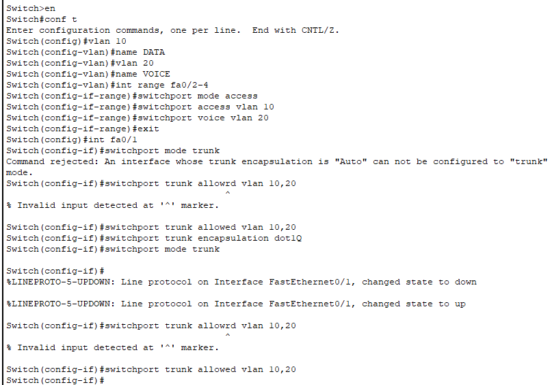  

**8. Регистрация IP-телефонов**  
Телефоны успешно подключились.  
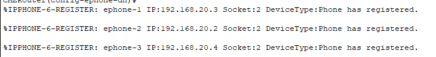

**9. Тестирование функционала**  
Успешный звонок **1001** → **1003**.  

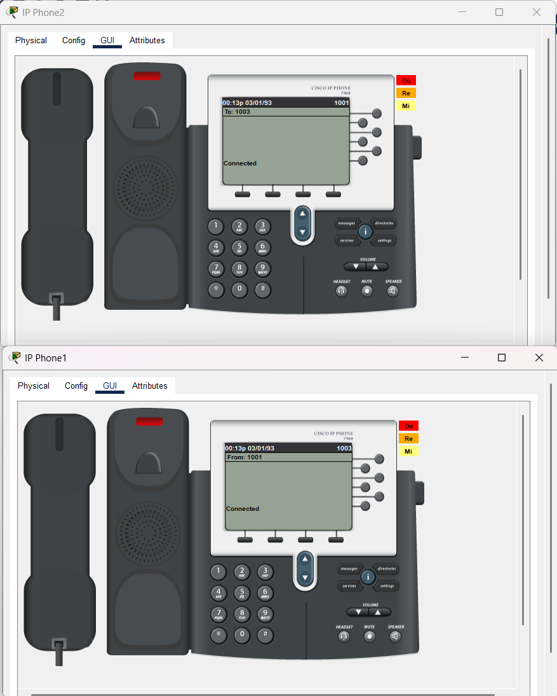  

### Часть 2. Расширение сети: интеграция ПК через IP-телефоны
**Доработка топологии**  
К существующей инфраструктуре добавлены 3 ПК, подключённые через порты IP-телефонов.  

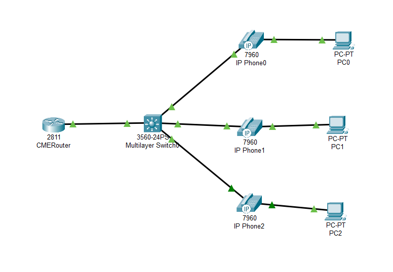  

**Автоматизация настроек**
Благодаря предварительно настроенным VLAN и DHCP:  
- ПК получили адреса из пула 192.168.10.0/24.
- Телефоны используют 192.168.20.0/24.

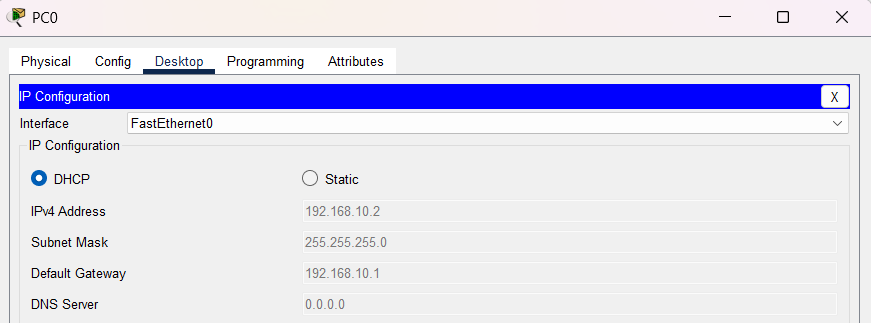  

**Верификация работоспособности**  
- Успешный ping между ПК.
- Корректная работа параллельных сессий (данные + голос).

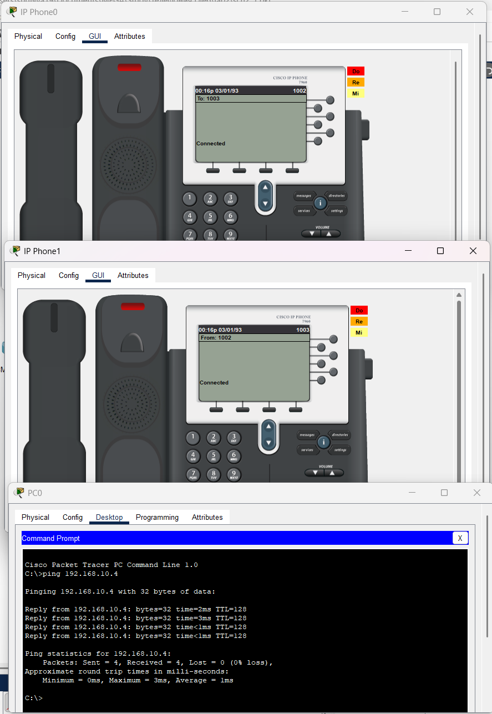  

## Вывод
В рамках работы реализована гибридная сеть, обеспечивающая:
- Разделение трафика на данные (VLAN 10) и голос (VLAN 20).
- Автоматическую выдачу IP-адресов через DHCP.
- Стабильную работу IP-телефонии на базе Cisco CME.
- Совместное использование ресурсов ПК и телефонов без конфликтов.  
Система протестирована на базовые функции связи, что подтвердило её корректную работу.
