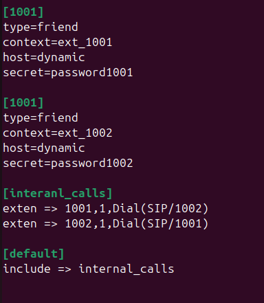
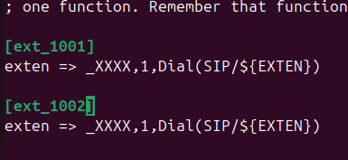

University: [ITMO University](https://itmo.ru/ru/)  
Faculty: [FICT](https://fict.itmo.ru)  
Course: [IP-telephony](https://github.com/itmo-ict-faculty/ip-telephony)  
Year: 2024/2025  
Group: K34202  
Author: Demin Gleb Igorevich  
Lab: Lab3  
Date of create: 10.03.2025  
Date of finished: 12.03.2025  

# Отчёт о Лабораторной работе №3  "Использование Asterisk в качестве SIP proxy"

## Описание работы

Для выполнения данной лабораторной работы необходимо выполнить настройку Asterisk.

## Цель работы

Изучить программный комплекс Asterisk. Настройка Asterisk для локальных звонков.  

## Ход работы

### 1. Установка и настройка Asterisk.

В работе использовалась ОС Ubuntu. На неё была установлена Asterisk  

  

После этого была проверена установка: проверка версии и проверка запуска через `systemctl status`  

  

  

Для создания двух абонентов (1001 и 1002) изменён файл /etc/asterisk/sip.conf. *На скриншоте ошибка, второй абонент позже был переписан на [1002]*  

  

- type=friend — аккаунт может работать как клиент (инициировать вызовы) и сервер (принимать вызовы).
- host=dynamic — сервер разрешает регистрацию с динамического IP-адреса.
- secret — пароль для аутентификации при регистрации.

В файл /etc/asterisk/extensions.conf были добавлены правила маршрутизации  

  

exten => _1XXX,1,Dial(...) — правило для обработки вызовов:  
- _1XXX — шаблон номера (любые 4 цифры, начинающиеся с 1).
- 1 — приоритет выполнения правила.
- Dial(SIP/${EXTEN}) — команда для установки вызова через SIP.
- ${EXTEN} — переменная, содержащая номер, на который совершен вызов.

После этого asterisk был перезагружен, были проверены пиры  

  

  

### 2. Установка и настройка софтфонов.

Далее необходимо было установить софтфоны. Софтфон, или программный телефон, представляет собой приложение, которое позволяет пользователям совершать и принимать телефонные звонки через интернет с использованием технологии VoIP (Voice over Internet Protocol). Изначально я планировал использовать jitsi, однако так и не смог разобраться с процессом установки, бился об одну и ту же ошибку.
В итоге было решено использовать Zoiper и MicroSIP (установлен с помощью wine).  

Настройка Zoiper  

  

  

После успешной настройки, номер был зарегестрирован  

  

Настройка MicroSIP

  

Второй номер так же был успешно зарегестрирован  

  

### 3. Проверка связи

Была проверена связанность: тестовый звонок с 1002 (MicroSIP) на 1001 (Zoiper)  

  

## Вывод

В данной работе был изучен программный комплекс Asterisk, после чего он был настроен для локальных звонков с использованием софтфонов.
